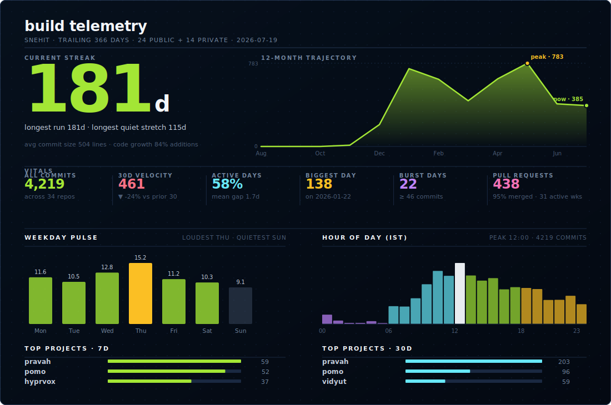
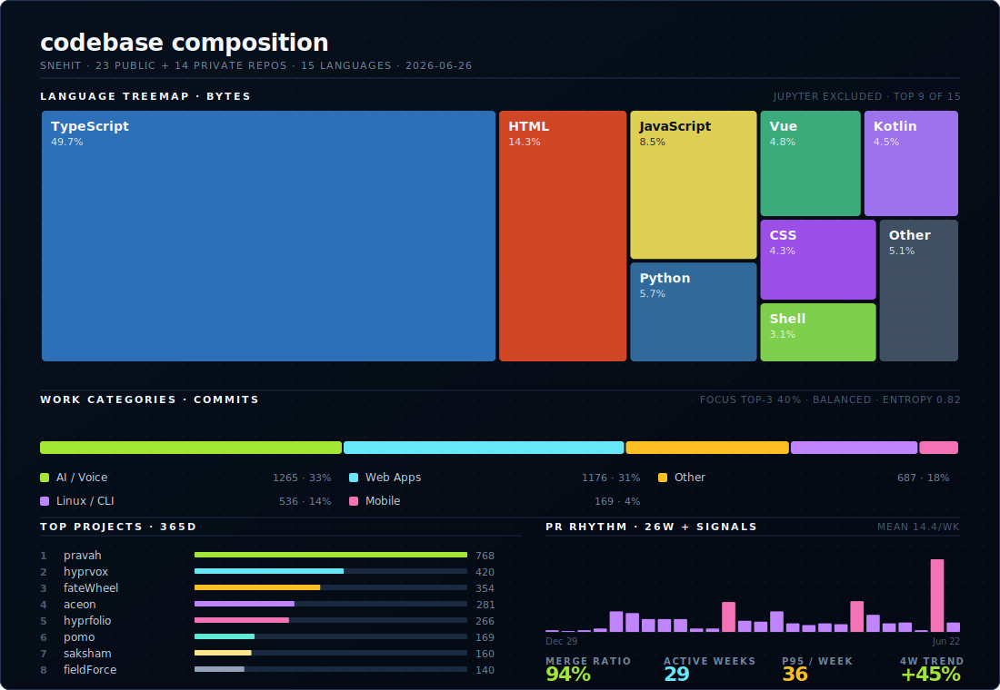

# Atulya Rai

> Building for the joy of it. Shipping for the thrill of it.

  
   
  

## Currently Working

### Public

- **[Hyprvox](https://github.com/Snehit70/hyprvox)** - One keypress, low-latency transcription: clipboard-first workflow with dual STT engines and systemd service.
- **[SystemdManager](https://github.com/Snehit70/systemdManager)** - Systemd TUI with live log tailing: browse, filter, and control your services without leaving the terminal.
- **[Lazydev](https://github.com/Snehit70/lazydev)** - Your dev servers, on demand: auto-scale to zero, wake on request, save gigabytes of RAM.
- **[Lapstat](https://github.com/Snehit70/lapstat)** - Historical system stats monitor for Linux laptops.
- **[Pomo](https://github.com/Snehit70/pomo)** - Mobile app for remotely controlling a desktop Pomodoro timer.
- **[Ralphy Monitor](https://github.com/Snehit70/ralphy-monitor)** - Real-time monitor for Ralphy: watch my AI coding loop work.

### Private

- **Pravah** - Timeline-based task manager with AI-agent API support.
- **Aceon** - A clean library of lectures, organized for easy access.
- **Praxis** - Active private build, still shaping the product surface.

## Live Projects

- **[Aceon](https://aceon.snehit70.dev)** - A clean library of lectures, organized for easy access.
- **[FateWheel](https://fate.snehit70.dev)** - A refined spin wheel that settles indecision instantly.
- **[Saksham](https://saksham-murex.vercel.app)** - Interview practice that turns a resume into focused technical screening.
- **[VoiceWeb](https://voiceweb.vercel.app)** - A lightweight web app for turning speech into usable text.
- **[GoCareer](https://gocareer.snehit70.dev)** - A student-friendly platform for exploring career paths with clarity.

